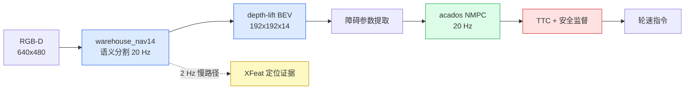
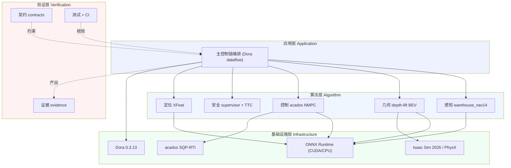
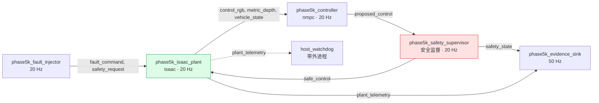
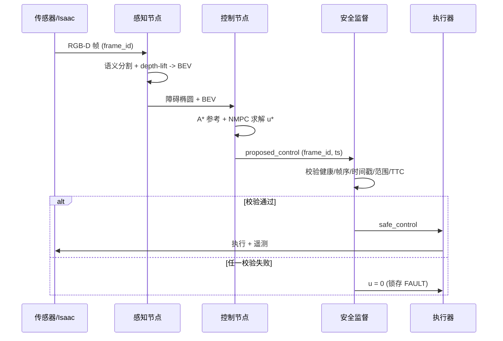
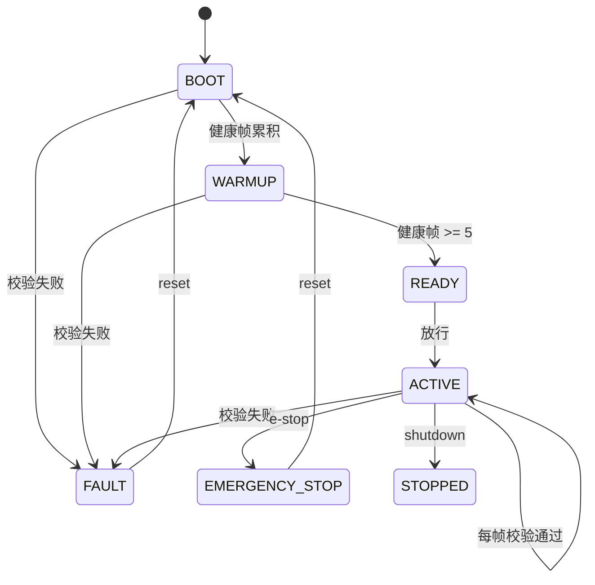
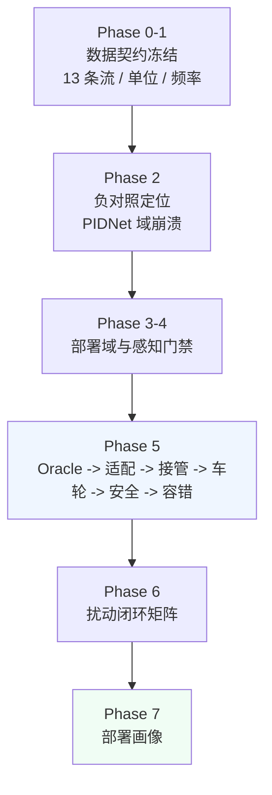
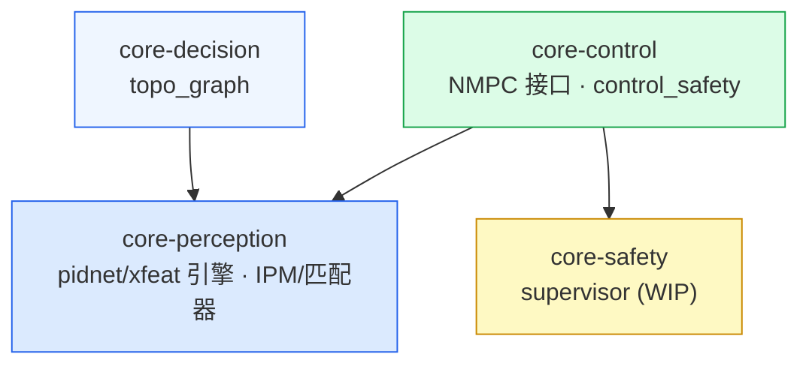
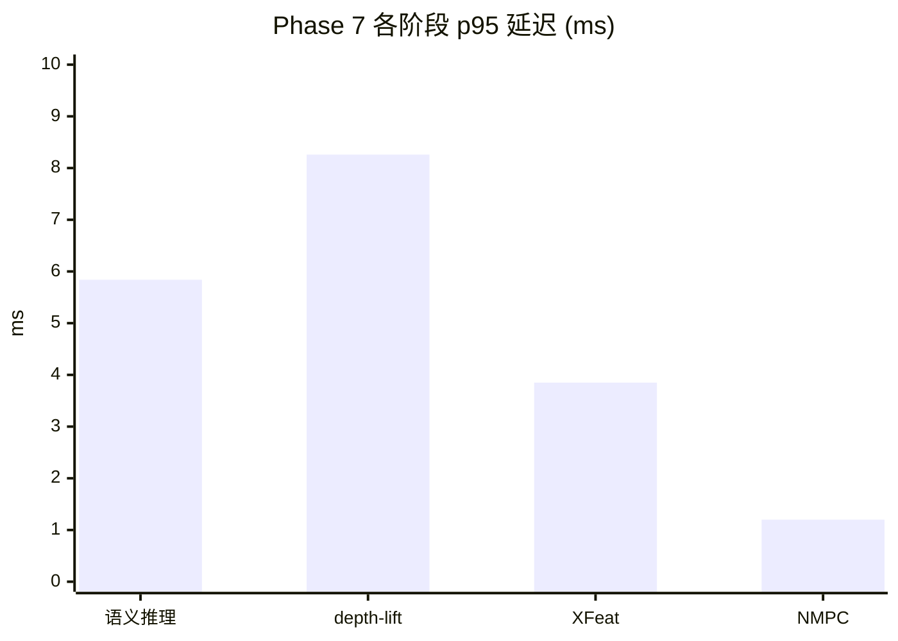
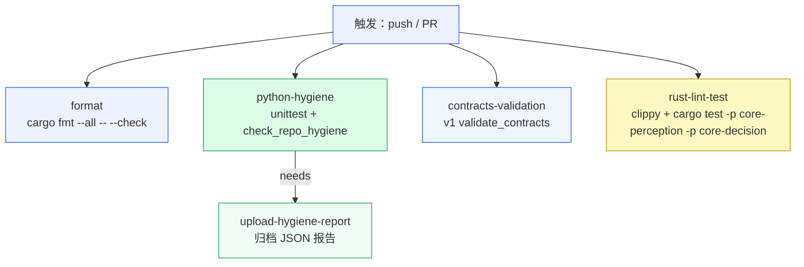

<div align="center">

# ADS 自动驾驶仿真测试验证

**ADS · Autonomous Driving Simulation · 低速室内仓库 AMR · 白盒仿真测试验证项目**

[](.github/workflows/ci.yml)
[](#6-验证结果)
[](#8-复现与验证)
[](Cargo.toml)
[](.github/workflows/ci.yml)
[](HANDOFF.md)

一条完整的「感知 → 几何 → 控制 → 安全」主链，在 Isaac 仿真域逐段白盒验证并冻结。
每个指标同时给出验收阈值 $\tau$ 与实测值 $\hat{x}$。

复旦大学 2024 年暑期自动驾驶训练营个人结营项目，由胡波教授指导；参考《自动驾驶：人工
智能理论与实践》。

</div>

---

## 目录

| # | 章节 | 内容 |
|:--|:--|:--|
| 1 | [项目概述](#1-项目概述) | 目标、范围、记号约定 |
| 2 | [系统结构](#2-系统结构) | 分层架构、数据流拓扑、单帧时序 |
| 3 | [技术方案](#3-技术方案) | 感知、几何、控制、规划、安全、定位 |
| 4 | [验证方法论](#4-验证方法论) | 分层 V 模型、六条纪律、门禁 |
| 5 | [软件架构](#5-软件架构) | Rust workspace 与运行时节点 |
| 6 | [验证结果](#6-验证结果) | 阈值 vs 实测 |
| 7 | [性能与算力画像](#7-性能与算力画像) | 部署延迟、硬件选型 |
| 8 | [复现与验证](#8-复现与验证) | 本地命令、CI |
| 9 | [实机部署建议](#9-实机部署建议) | 硬件、标定流程、红线 |
| 10 | [仓库结构](#10-仓库结构) | 目录职责与权威文件 |

---

## 1. 项目概述

### 1.1 背景

本项目是**复旦大学 2024 年暑期自动驾驶训练营**的个人结营项目，由**胡波教授**指导。
项目选题、系统设计、实现与验证由作者独立完成，方法论与工程实现参考了训练营课程及
《自动驾驶：人工智能理论与实践》一书的理论框架。

### 1.2 目标与范围

ADS 在**仿真环境**中构建并验证一条完整的低速室内仓库 AMR 自动驾驶主链。选仿真
优先的原因很直接：算法、坐标系、控制律、安全逻辑都能在物理硬件到位前先行验证，且每
一次运行完全可复现。

| 维度 | 说明 |
|:--|:--|
| 运行域 | 低速室内仓库/封闭场地，平坦硬地面 |
| 速度上限 | $v_{\max} = 0.8\ \mathrm{m/s}$ |
| 平台 | 差速驱动 AMR |
| 输入 | RGB $640\times480$ + 公制深度 |
| 采样率 | 控制 $f_c = 20\ \mathrm{Hz}$，物理 $100\ \mathrm{Hz}$ |
| 验证域 | Isaac Sim 2026 全物理仿真 |

### 1.3 主控制链



### 1.4 记号约定

| 符号 | 含义 | 单位 |
|:--|:--|:--|
| $\mathbf{x} = [x, y, \theta, v]^\top$ | 车辆状态（位置、航向、线速度） | m, m, rad, m/s |
| $\mathbf{u} = [a, \omega]^\top$ | 控制（加速度、角速度） | m/s², rad/s |
| $z, (u,v)$ | 深度、图像像素坐标 | m, px |
| $\mathbf{K}$ | 相机内参矩阵 | px |
| $f_c, \Delta t$ | 控制频率、控制周期 | Hz, s |
| $T_{\text{stop}}$ | 故障停机延迟 | 帧 |
| $h_i(\cdot)$ | NMPC 第 $i$ 个障碍约束 | 无量纲 |

## 2. 系统结构

### 2.1 分层架构



### 2.2 数据流拓扑

主链运行时是 Dora 数据流。以 Phase 5-K 韧性拓扑为例，节点边界与发布/消费关系：



> **单点权威**：`phase5k_safety_supervisor` 是唯一能发布 `safe_control` 的节点；控制器与
> 注入器没有车轮输出边。

### 2.3 单帧时序

一帧内的交互顺序（控制周期 $\Delta t = 50\ \mathrm{ms}$）：



### 2.4 模块职责

| 模块 | 目录 | 角色 | 频率 |
|:--|:--|:--|:--|
| 语义感知 | `core-perception` | 14 类仓库语义分割 → BEV | 20 Hz |
| 几何 BEV | depth-lift | 公制深度 → $192\times192\times14$ 占据栅格 | 20 Hz |
| 局部控制 | `core-control` | SQP-RTI NMPC，差速车 | 20 Hz |
| 安全监督 | `core-control` | 状态机急停 + TTC 限速 | 20 Hz |
| 视觉定位 | `core-perception` | XFeat 稀疏匹配置信 | 2 Hz |
| 拓扑决策 | `core-decision` | 拓扑图与慢速决策 | 事件驱动 |

## 3. 技术方案

### 3.1 感知：语义分割与 depth-lift BEV

感知输出逐像素 14 类语义 id，配合公制深度构造 BEV。用「语义分割 + 深度」而非纯视觉
端到端策略，是因为控制与安全需要可解释的几何量。

**两条 BEV 路径**，主链只用 depth-lift：

| 路径 | 原理 | 局限 |
|:--|:--|:--|
| 平面 IPM | 假设像素落在地平面 $z=0$，针孔反投影 | 立体障碍投影到其身后地面，产生错误 |
| depth-lift | 用真实深度逐像素反投影 | 主链采用 |

**depth-lift 三步变换**：

$$
\begin{aligned}
\text{(1) 针孔反投影：}\quad
x_c &= \frac{(u - c_x)}{f_x}\, z, \qquad
y_c = \frac{(v - c_y)}{f_y}\, z \\[4pt]
\text{(2) 相机→车体：}\quad
\mathbf{p}_b &= \mathbf{R}_{\text{roll}}\mathbf{R}_{\text{pitch}}\mathbf{R}_{\text{yaw}}\,\mathbf{p}_c + \mathbf{t}_{bc} \\[4pt]
\text{(3) 车体→栅格：}\quad
r &= \Big\lfloor r_{\text{ego}} - \tfrac{f}{s} \Big\rceil, \qquad
c = \Big\lfloor c_{\text{ego}} - \tfrac{l}{s} \Big\rceil
\end{aligned}
$$

其中 $s = 20/192 = 0.10417\ \mathrm{m/cell}$ 为栅格分辨率，$(r_{\text{ego}}, c_{\text{ego}}) = (95.5, 95.5)$
为自车原点。

**高度带过滤**抑制噪声，仅保留：

$$
z_{\text{floor}} \in [-0.05,\, 0.08]\ \mathrm{m}, \qquad
z_{\text{obstacle}} \in [0.02,\, 0.35]\ \mathrm{m}
$$

**栅格仲裁**按优先级 $\pi = [13, 0, 1, 2, \dots, 12]$ 写入；未观测格保持 `unknown` 并
视为占据（fail-closed）：

$$
M(r,c) = \operatorname*{arg\,max}_{k \in \pi} \mathbb{1}\!\left[\text{cell } (r,c) \leftarrow k\right]
$$

### 3.2 局部控制：acados NMPC

差速车建模为**单车（unicycle）**系统，用 acados SQP-RTI 求解：

$$
\dot{\mathbf{x}} = f(\mathbf{x}, \mathbf{u}) =
\begin{bmatrix} v\cos\theta \\ v\sin\theta \\ \omega \\ a \end{bmatrix}
$$

以 $N = 20$ 步、步长 $\Delta t = 0.05\ \mathrm{s}$（视界 1 s）离散求解：

$$
\min_{\mathbf{x}_{0:N},\,\mathbf{u}_{0:N-1}} \sum_{k=0}^{N} \big\|\mathbf{x}_k - \mathbf{x}^{\text{ref}}_k\big\|_Q^2 + \sum_{k=0}^{N-1} \big\|\mathbf{u}_k\big\|_R^2
$$

**椭圆障碍约束**（半平面近似，软约束）。对每个近邻障碍 $i$，取
$\mathbf{p}_i = [o_x, o_y, a_i, b_i]^\top$：

$$
h_i(\mathbf{x}) = \frac{(x - o_x)^2}{a_i^2 + \epsilon} + \frac{(y - o_y)^2}{b_i^2 + \epsilon} \;\ge\; 1, \quad \epsilon = 10^{-6}
$$

**命令饱和**与速度状态约束：

$$
v \in [0.0,\, 0.8], \qquad \omega \in [-0.6,\, 0.6]
$$

**近邻障碍提取**把 BEV 占据格按车体朝向切成三个扇区，每扇区保留最近障碍：

| 扇区 | 前向范围 $x_l$ | 侧向范围 $y_l$ | 椭圆轴 |
|:--|:--|:--|:--|
| 左 | $[0.1, 2.2]\ \mathrm{m}$ | $y_l > 0.15$ | $a{=}0.35$, $b{=}0.25$ |
| 中 | $[0.1, 2.2]\ \mathrm{m}$ | $\lvert y_l\rvert \le 0.15$ | $a{=}0.35$, $b{=}0.25$ |
| 右 | $[0.1, 2.2]\ \mathrm{m}$ | $y_l < -0.15$ | $a{=}0.35$, $b{=}0.25$ |

### 3.3 全局规划：A* 与占据栅格

全局层用 8 连通 A* 在占据栅格上规划参考路径。栅格含三张图：原始占据 $O_{\text{raw}}$、
外接半径膨胀占据 $O_{\text{inf}}$、到最近障碍的距离场 $D(\mathbf{p})$。

代价函数（含启发式 $h$）：

$$
g(n) = g(\text{parent}) + \lVert \mathbf{p}_n - \mathbf{p}_{\text{parent}} \rVert, \qquad
f(n) = g(n) + h(n)
$$

**碰撞检测用 yaw-aware 矩形足迹**，不把机器人当质点。半长/半宽加安全裕度后采样
$\{(x_j, y_j)\}$：

$$
(x_j, y_j) = \mathbf{p} + R(\theta)\, \mathbf{d}_j, \qquad
\text{collide} \iff \exists j:\ O_{\text{raw}}\big(\lfloor \mathbf{p}\rfloor_{x_j, y_j}\big) = 1
$$

### 3.4 安全监督：状态机与 TTC

安全监督是唯一的轮速权威，是一台显式状态机。



**每帧校验清单**（任一失败即 `FAULT` 并锁存 $u \leftarrow 0$）：

| 校验 | 条件 |
|:--|:--|
| 输入齐全 | health $\neq \varnothing \wedge$ command $\neq \varnothing$ |
| 运行健康 | sensor $\wedge$ perception $\wedge$ solver $\wedge$ articulation |
| 帧一致 | $\text{frame}_h = \text{frame}_c$ |
| 帧连续 | $\text{frame}_k = \text{frame}_{k-1} + 1$ |
| 时间戳新鲜 | $t_{\text{now}} - t_{\text{msg}} \le \tau_{\text{wd}} = 150\ \mathrm{ms}$ |
| 命令有界 | $0 \le v \le 0.8,\ \lvert \omega\rvert \le 0.6$ |

**TTC 安全律**（时间到碰撞阈值）：

$$
\text{action}(\text{TTC}) =
\begin{cases}
\text{EmergencyStop}, & \text{TTC} < 1.0\ \mathrm{s} \ \lor\ \text{TTC} = \text{NaN} \\
\text{LimitSpeed}(v \le 0.2), & 1.0 \le \text{TTC} < 2.0\ \mathrm{s} \\
\text{Pass}, & \text{TTC} \ge 2.0\ \mathrm{s}
\end{cases}
$$

### 3.5 定位：XFeat 匹配与亚像素细化

XFeat（$640\times640$，2 Hz）做稀疏特征提取与双向匹配。匹配得分用余弦相似度：

$$
\text{sim}(\mathbf{f}_a, \mathbf{f}_b) = \frac{\mathbf{f}_a \cdot \mathbf{f}_b}{\lVert \mathbf{f}_a\rVert\, \lVert \mathbf{f}_b\rVert}
$$

候选匹配做前向-后向一致性过滤（互最近邻）。亚像素偏移用局部抛物线拟合：

$$
\delta = \frac{s_{-} - s_{+}}{2\,(s_{-} - 2 s_0 + s_{+})}, \qquad \delta \in [-1, 1]
$$

其中 $s_0, s_\pm$ 为在 $\pm$ 步长处采样的描述子相似度。**单应性无尺度、未写回米制
位姿，当前只作为匹配证据，不进入控制回路。**

## 4. 验证方法论

### 4.1 分层 V 模型

每一层有独立验收门禁，下层通过才允许上层引用：



### 4.2 六条验证纪律

| 纪律 | 定义 |
|:--|:--|
| 契约先行 | 每个 phase 先冻结 `*_contract.json`（含阈值 $\tau$），状态置 `frozen_before_execution`，再执行 |
| 阈值对照 | 每个指标同时记录阈值 $\tau$ 与实测 $\hat{x}$，判定 $\hat{x} \lessgtr \tau$ |
| 逐文件哈希 | 每 phase 带 `SHA256SUMS`，状态 JSON 引用上游哈希，形成可信链 |
| 负对照 | 保留 PIDNet 必须失败（ROI 假占用 $\approx 100\%$），否则说明测试没测到问题 |
| 故障注入 | 主动强杀进程、制造 GPU OOM、写满磁盘，验证 fail-safe |
| 权限最小化 | 安全监督是唯一轮速权威；控制提案默认被拦截 |

### 4.3 验收门禁阈值

**感知门禁（Phase 4）**

| 指标 | 阈值 $\tau$ |
|:--|:--|
| 最少帧数 | 1,000 |
| 精确帧比例 | ≥ 0.99 |
| 语义 GT / 感知有效比例 | ≥ 0.99 |
| 延迟 p95 | ≤ 50 ms |
| 退化 ROI 帧比例 | ≤ 0.01 |
| 假自由率 / 假占用率 | ≤ 0.05 / ≤ 0.20 |
| 自由 IoU / 占据 IoU | ≥ 0.70 / ≥ 0.50 |

**闭环与部署门禁（Phase 6 / 7）**

| 门禁 | 阈值 $\tau$ |
|:--|:--|
| sensor-to-wheel p95 | ≤ 50 ms |
| 路径误差 p95 | ≤ 0.30 m |
| 终点位置 / 航向误差 | ≤ 0.15 m / ≤ 0.12 rad |
| NMPC p95 | ≤ 10 ms |
| CUDA provider | 必需 |

## 5. 软件架构

### 5.1 Rust workspace



箭头为 Cargo 依赖方向：`core-control` 依赖 `core-perception` 与 `core-safety`，
`core-decision` 依赖 `core-perception`。`core-perception` 与 `core-safety` 是叶子 crate，
不依赖其他内部 crate。

| crate | 关键模块 | 职责 |
|:--|:--|:--|
| `core-perception` | `ipm_projector`、`matcher`、`xfeat_engine`、`pidnet_engine` | 感知与定位基础组件 |
| `core-control` | `control_safety`、`ffi`、`solver`、`sensor_fusion` | 快控制、安全检查、NMPC 接口 |
| `core-decision` | `topo_graph` | 拓扑图与慢速决策 |
| `core-safety` | `lib`（WIP） | 待接入的安全监督 |

**工作区依赖**：`opencv 0.93`、`ort =2.0.0-rc.11`（load-dynamic）、`tokio 1.38`、
`ndarray 0.15`；release 开启 `lto`、`codegen-units=1`、`panic=abort`、`strip`。

### 5.2 运行时安全常量（`control_safety.rs`）

| 常量 | 值 |
|:--|:--|
| `CONTROL_DT_SECONDS` | $0.05\ \mathrm{s}$ |
| `OCP_HORIZON_STAGES` | $20$ |
| `MAX_LINEAR_SPEED_MPS` | $0.80$ |
| `MAX_YAW_RATE_RPS` | $0.60$ |
| `TTC_EMERGENCY_STOP_SECONDS` | $1.0\ \mathrm{s}$ |
| `TTC_SLOWDOWN_SECONDS` | $2.0\ \mathrm{s}$ |
| `ODOMETRY_STALE_MS` / `BEV_GRID_STALE_MS` / `TTC_STALE_MS` | 250 / 500 / 250 ms |

## 6. 验证结果

### 6.1 Phase 2：负对照触发预期崩溃

| 指标 | 预期 | 实测 | 判定 |
|:--|:--|:--|:--|
| ROI 假占用率 | 应接近 100% | `0.99971` | ✅ 如期崩溃 |
| BC 假占用率 | 应接近 100% | `0.99936` | ✅ |
| BC 自由 IoU | 应接近 0 | `0.00064` | ✅ |
| 测试帧数 | 1,057 | 1,057 | ✅ |

Cityscapes PIDNet 在原仿真域确认退化，感知错误不能归咎于下游 NMPC。

### 6.2 Phase 5：分阶段接管


**关键子阶段指标**

| 子阶段 | 关键结果 |
|:--|:--|
| 5-A | 3/3 场景，零碰撞，求解 p95 `2.08 ms` |
| 5-C3 | 候选 mIoU `0.6631`，占据 IoU `0.5887`，端到端 p95 `14.39 ms` |
| 5-D | 3 种子占据 IoU 0.5821 / 0.6186 / 0.5076，运行时 p95 `25.02 ms` |
| 5-F | 命令 MAE $a{:}0.0022$, $\omega{:}0.0038$，p95 `23.68 ms` |
| 5-G | 1473/1473 命令，路径 p95 `0.0435 m`，sensor-to-command p95 `229.11 ms` |
| 5-H | 1454/1454 轮命令，sensor-to-wheel p95 `37.97 ms`，比值 0.979~0.981 |

### 6.3 Phase 5-K：耐久 + 故障注入

| 指标 | 阈值 | 实测 | 判定 |
|:--|:--|:--|:--|
| 耐久帧数 | n/a | 72,000（`3611.33 s` / 131 episodes） | ✅ |
| 闭环总帧数 | n/a | 72,814 | ✅ |
| 碰撞次数 | 0 | 0 | ✅ |
| 最大可恢复故障停机延迟 $T_{\text{stop}}$ | 1 帧 | 1 帧 | ✅ |
| 协调器停机延迟 | n/a | `41.88 ms` | ✅ |
| 守护进程停机延迟 | n/a | `7.43 ms` | ✅ |
| GPU OOM 释放率 | n/a | `0.971` | ✅ |

故障注入覆盖：协调器 SIGKILL、守护进程 SIGKILL、GPU OOM（9.40 GB 触发）、磁盘写满
（errno 28）。全部通过 `all_run_gates_passed = true`。

### 6.4 Phase 6：最终仿真矩阵

| 指标 | 阈值 $\tau$ | 实测（最差） | 判定 |
|:--|:--|:--|:--|
| 用例数 | 12 | 12/12 | ✅ |
| 到达率 | ≥ 1.00 | 1.00 | ✅ |
| 碰撞次数 | ≤ 0 | 0 | ✅ |
| 求解失败 | ≤ 0 | 0 | ✅ |
| sensor-to-wheel p95 | ≤ 50 ms | `33.06 ms` | ✅ |
| 路径误差 p95 | ≤ 0.30 m | `0.0914 m` | ✅ |
| 终点位置误差 | ≤ 0.15 m | `0.1014 m` | ✅ |
| 终点航向误差 | ≤ 0.12 rad | `0.1098 rad` | ✅ |

覆盖 $3$ 种子 × $4$ 场景（直道 / 斜转角 / 绕托盘 / 横穿小车）× $3$ 光照，扰动维度含
起点终点、光照、材质、JPEG-RGB、公制深度、相机外参、动态障碍共 $7$ 项。

### 6.5 Phase 7：无 Isaac 部署画像

| 阶段 | 阈值 $\tau$ | p95 实测 | 判定 |
|:--|:--|:--|:--|
| 语义推理 | n/a | `5.84 ms` | ✅ |
| depth-lift BEV | n/a | `8.26 ms` | ✅ |
| NMPC | ≤ 10 ms | `1.20 ms` | ✅ |
| XFeat 640x640 | ≤ 500 ms | `3.85 ms` | ✅ |
| **控制主链合计** | **≤ 50 ms** | **`17.07 ms`** | ✅ |

资源占用：进程 RSS 增量峰值 `1211.97 MiB`，桌面 GPU VRAM 增量峰值 `253 MiB`，声明流
带宽 `87.57 Mbps`。

## 7. 性能与算力画像

### 7.1 各阶段延迟



### 7.2 硬件选型

**算力下限**：内存 ≥ 16 GB、带宽 ≥ 100 GB/s、算力 ≥ 100 TOPS、模组功耗 ≤ 40 W。

| 候选 | 内存 | 带宽 | 算力 | 功耗 | 定位 |
|:--|:--|:--|:--|:--|:--|
| Jetson Orin Nano Super 8GB | 8 GB | 102 GB/s | 67 TOPS | 25 W | 仅最小原型 |
| **Jetson Orin NX 16GB Super** | **16 GB** | **102 GB/s** | **157 TOPS** | **40 W** | **正式推荐** |
| Jetson AGX Orin 32GB | 32 GB | 204.8 GB/s | 200 TOPS | 40 W | 高余量选项 |

## 8. 复现与验证

### 8.1 环境

| 组件 | 版本 |
|:--|:--|
| OS | Ubuntu 26.04 |
| Rust | 1.96.1 |
| Dora | 0.3.13 |
| uv | 0.11.26 |
| Isaac Sim Python | 3.12 |

Isaac Sim 与 acados 不进 Git。acados 按 [`HANDOFF.md`](HANDOFF.md) 以
`git clone --recursive` 克隆到 `simulation-env/acados` 并固定 commit 编译。

```bash
cp .env.example .env
```

### 8.2 本地命令

不依赖 Isaac（Windows 或精简环境可运行）：

```bash
python -m unittest discover -s scripts -p 'test_*.py'
python scripts/check_code_style.py
python scripts/check_repo_hygiene.py
cargo fmt --all -- --check
```

Linux 权威验证：

```bash
python contracts/v1/validate_contracts.py
PYTHONPATH=contracts/phase5 "$ISAAC_SIM_PYTHON_SH" \
  -m unittest discover -s contracts/phase5 -p 'test_*.py'
cargo build --workspace --locked
```

本地有原始 `artifacts/` 时再运行 phase 验证器：

```bash
python contracts/phase6/validate_phase6.py
python contracts/phase7/validate_phase7.py
```

### 8.3 CI 覆盖



同一事件触发四道 job 并行执行，`upload-hygiene-report` 依赖 `python-hygiene` 归档机器
可读的卫生报告。仓库共 39 个测试文件（36 在 `contracts/`，2 在 `scripts/`，
1 在 `simulation-env/`）。

## 9. 实机部署建议

仿真主链已验证，下面是把同一套算法迁移到实机时推荐的配置与流程。这些是针对本项目观察
到的带宽、算力和传感器需求给出的工程建议，尚未在实机复现。

### 9.1 推荐硬件

| 部件 | 推荐 | 理由 |
|:--|:--|:--|
| 计算模块 | Jetson Orin NX 16GB Super | 157 TOPS、102 GB/s，满足 Phase 7 画像 |
| 深度相机 | RealSense D455 | 全局快门 RGB+深度，理想量程 0.6 到 6.0 m |
| IMU/里程计 | 轮速编码器 + 6 轴 IMU | 米制定位融合输入 |
| 执行器 | 带编码器差速电机 + MCU | 闭环速度跟踪 |
| 安全 | 物理急停按钮 | 独立于软件的安全回路 |

### 9.2 迁移流程

| 步 | 门禁 | 阈值 |
|:--|:--|:--|
| 1 | 相机标定 | ≥ 20 张棋盘格，重投影 RMS ≤ 0.5 px，深度尺度相对误差 ≤ 2% |
| 2 | 定位 | ATE RMSE ≤ 0.10 m，丢帧率 ≤ 1% |
| 3 | 全局地图 | 现场 SLAM，8 路线成功率 100%，非法路点 0 |
| 4 | 独立安全 | 停车召回 ≥ 0.99，放行特异度 ≥ 0.95 |
| 5 | 执行器 | watchdog/急停 p95 ≤ 150 ms，残余爬行 ≤ 0.01 m/s |

### 9.3 上实机前的红线

- 仿真语义 BEV 不能同时充当控制输入和安全监督，实机必须用独立深度 guard。
- XFeat 匹配数不是米制定位结果，未完成尺度融合前不得用于规划。
- 物理急停与编码器闭环到位前，不做落地轮测试。分级推进：架空轮 → 系绳 → 封闭场地。

## 10. 仓库结构

```text
FSD/
├── core-perception/      Rust 感知与 XFeat 基础组件
├── core-control/         Rust 快控制、安全检查与 NMPC 接口
├── core-decision/        拓扑图与慢速决策代码
├── core-safety/          Rust 安全监督（WIP）
├── simulation-env/       Isaac、数据采集与 acados 求解器生成入口
├── contracts/
│   ├── v1/               数据、坐标系与 Dora 流契约
│   ├── phase3-7/         仿真感知、控制、鲁棒性与部署验收
│   └── real_vehicle/     实机部署前置检查
├── model/                两个 ONNX 模型及哈希清单
├── scripts/              仓库卫生检查与代码风格检查
├── docs/evidence/        聚合指标与证据入口
└── assets/               USD 场景与 props
```

| 层 | 目录 | 职责 |
|:--|:--|:--|
| 契约层 | `contracts/` | 数据契约、坐标系、各 phase 门禁与状态 JSON |
| 实现层 | `core-*/`、`simulation-env/` | Rust 组件、Isaac 节点与 acados solver |
| 证据层 | `docs/evidence/`、`*/SHA256SUMS` | 聚合指标、逐文件哈希冻结 |
| 资产层 | `assets/`、`model/` | 冻结场景与发布模型 |

**权威文件**

| 文件 | 作用 |
|:--|:--|
| [`docs/evidence/final_metrics.json`](docs/evidence/final_metrics.json) | 仓库级聚合指标 |
| [`HANDOFF.md`](HANDOFF.md) | 工程交接与结论 |
| [`contracts/v1/data_contracts.json`](contracts/v1/data_contracts.json) | 数据/坐标系/Dora 流契约 |
| [`contracts/phase3/domain_scene_baseline.json`](contracts/phase3/domain_scene_baseline.json) | 部署域、相机几何、BEV、语义表 |
| [`contracts/phase5/phase5k_status.json`](contracts/phase5/phase5k_status.json) | 耐久 + 故障注入冻结 |
| [`contracts/phase6/phase6_status.json`](contracts/phase6/phase6_status.json) | 扰动闭环矩阵 |
| [`contracts/phase7/phase7_status.json`](contracts/phase7/phase7_status.json) | 无 Isaac 部署画像 |
| [`model/DELIVERY.json`](model/DELIVERY.json) | 模型 SHA-256 |

**模型**：Git 只发布 `model/warehouse_nav14_candidate.onnx`（语义）与
`model/xfeat_640x640.onnx`（定位特征）。运行前核对 SHA-256。PIDNet、Spiced Brain、
BC/PPO checkpoint 均为 `inactive`。
